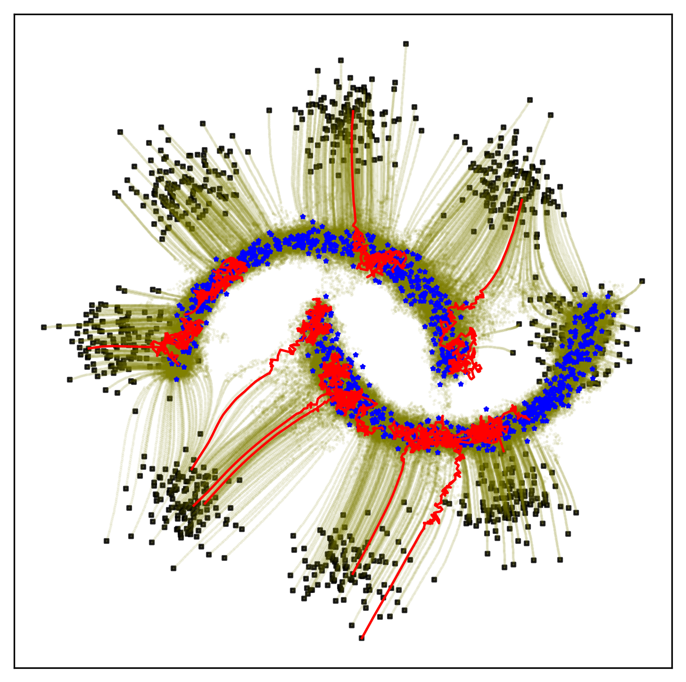
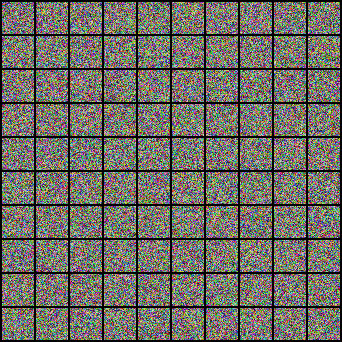

# Energy Matching


Energy Matching unifies flow matching and energy-based models in a single time-independent scalar field, enabling efficient transport between the source and target distributions while retaining explicit likelihood information for flexible, high-quality generation.

**Version 0.1** – This is the official repository for the paper [Energy Matching](https://arxiv.org/abs/2504.10612).

### Checkpoints
Pretrained CIFAR-10 checkpoints are available at [Hugging Face](https://huggingface.co/m1balcerak/energy_matching).
Use `cifar10_warm_up_145000.pt` for the warm-up phase and `cifar10_main_training_147000.pt` after the main training. The latter reaches FID of **3.3** around `T=3.25`.

### Setup (CUDA)
1. Create and activate a Python environment (conda example):
   ```bash
   conda create -n energy-matching python=3.10 -y
   conda activate energy-matching
   ```
2. Install PyTorch with CUDA support and the project requirements:
   ```bash
   pip install torch torchvision torchaudio --index-url https://download.pytorch.org/whl/cu118
   pip install -r requirements.txt
   ```

## Running the examples
- A simple 2D playground is provided in `experiments/toy2d/tutorial_2D.ipynb`.

### CIFAR‑10 Training and Evaluation

<p align="center">
  <strong>Langevin Monte Carlo (unconditional) <br> Trajectory from T = 0 to T = 4 (FID = 3.3)</strong><br>
  
</p>

Initial training (warm-up, Algorithm 1):
```bash
torchrun --nproc_per_node=4 experiments/cifar10/train_cifar_multigpu.py \
    --lr 1.2e-3 \
    --batch_size 128 \
    --epsilon_max 0.0 \
    --total_steps 145000 \
    --n_gibbs 0 \
    --lambda_cd 0. \
    --time_cutoff 1.0 \
    --ema_decay 0.9999 \
    --save_step 5000
```
Main training with contrastive divergance (Algorithm 2):
```bash
torchrun --nproc_per_node=4 experiments/cifar10/train_cifar_multigpu.py \
    --lr 1.2e-3 \
    --batch_size 128 \
    --resume_ckpt /PATH/TO/warm_up_checkpoint.pt \
    --total_steps 147000 \
    --epsilon_max 0.01 \
    --n_gibbs 200 \
    --lambda_cd 1e-3 \
    --time_cutoff 1.0 \
    --ema_decay 0.99 \
    --save_step 100 \
    --dt_gibbs 0.01 \
    --cd_neg_clamp 0.02  \
    --split_negative True \
    --same_temperature_scheduler True \
    --save_step 100
```
Evaluation across trajectories at times `T=1.0` to `T=5.0`:
```bash
python experiments/cifar10/fid_cifar_heun_1gpu.py \
    --resume_ckpt=/PATH/TO/main_training_checkpoint.pt \
    --output_dir=./sampling_results \
    --epsilon_max 0.01 \
    --time_cutoff 1.0 \
    --batch_size=64 \
    --use_ema True \
    --dt_gibbs 0.01
```
Pretrained CIFAR-10 checkpoints are available at [Hugging Face](https://huggingface.co/m1balcerak/energy_matching_cifar10).
Use `cifar10_warm_up_145000.pt` for the warm-up phase and `cifar10_main_training_147000.pt` after the main training. The latter obtains an **FID of 3.3** at around `T=3.25`.
### Protein inverse design
Train the model with:
```bash
python experiments/proteins/train_proteins_latent.py \
    --epsilon_max 0.1 \
    --time_cutoff 0.9 \
    --n_gibbs 200 \
    --dt_gibbs 0.01
```
Conditional sampling:
```bash
python experiments/proteins/sampling_latent.py
```
The VAE used for the continuous latent space is already provided.


## Citation

If you find our work useful, please consider citing:

```bibtex
@article{balcerak2025energy,
  title={Energy Matching: Unifying Flow Matching and Energy-Based Models for Generative Modeling},
  author={Balcerak, Michal and Amiranashvili, Tamaz and Terpin, Antonio and Shit, Suprosanna and Bogensperger, Lea and Kaltenbach, Sebastian and Koumoutsakos, Petros and Menze, Bjoern},
  journal={arXiv preprint arXiv:2504.10612},
  year={2025}
}
```
